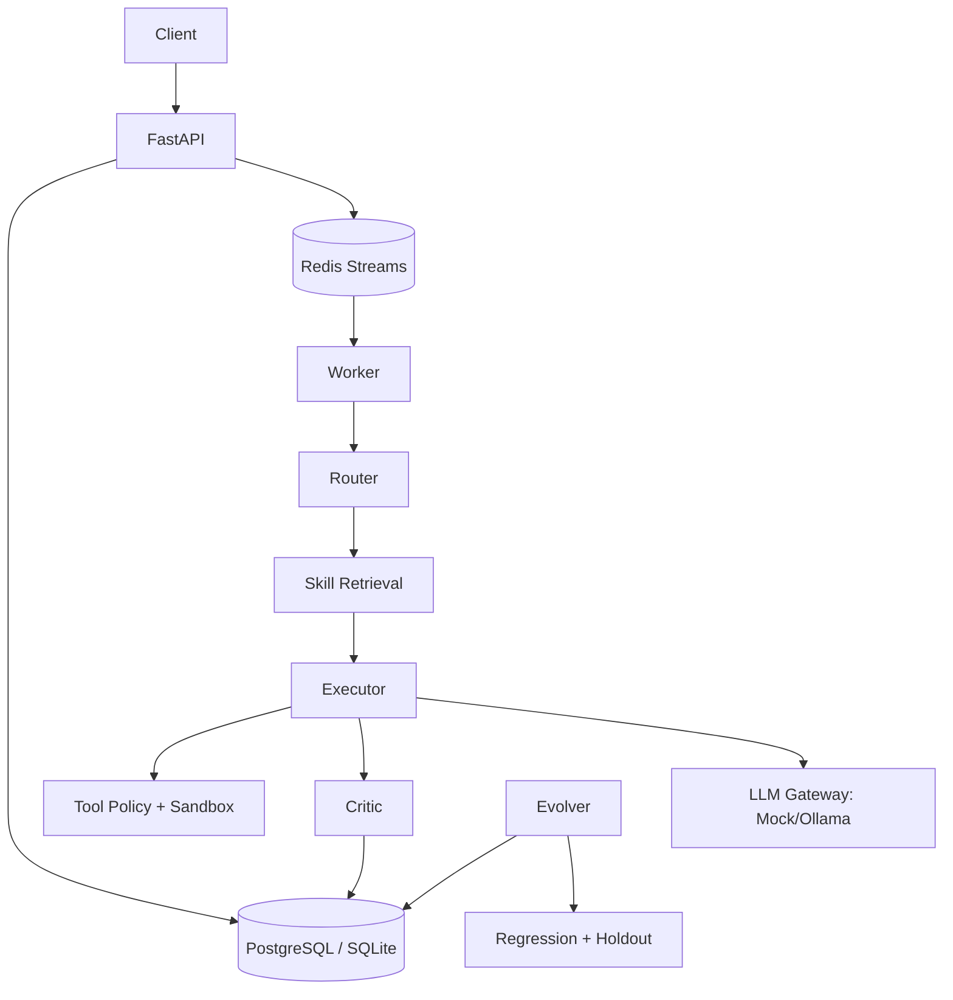
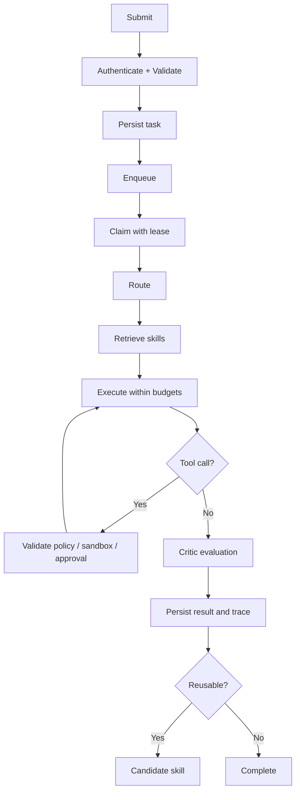

# Hermes Agent Architecture

## System structure

## Operational workflow

## Trust boundaries

- Model output is untrusted and must not grant itself new permissions.
- HTTP content is untrusted data and must be isolated from system instructions.
- File tools are confined to `workspace/`.
- Webhooks are restricted by `WEBHOOK_ALLOW`.
- Customer-facing actions should use a human approval layer before production.

## Current implementation status

- Implemented: FastAPI, task persistence, inline execution, Redis queue adapter, worker, Mock/Ollama gateway, routing, critic schema, file/Python/HTTP/webhook tool safeguards, Docker Compose, tests.
- Planned: pgvector retrieval, reranking service, real Evolver promotion, migrations, distributed leases, full rate limiting, approval UI, metrics export, and stronger sandbox isolation.
