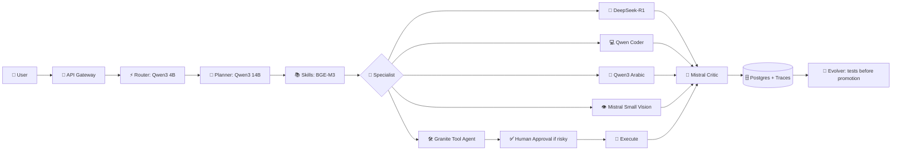

# 🧠 Hermes Agent — Open Model Fleet & Internal Agent Chain

**Project owner:** Ahmed MO Kireldin  
**Project website:** [Ahmedmokireldin.online](https://Ahmedmokireldin.online)

> Hermes Agent is an independent self-hosted project owned by **Ahmed MO Kireldin**. Model names, weights, trademarks, and third-party licenses remain with their respective owners.

## 🎯 هدف هذه الطبقة

تضيف هذه الطبقة مجموعة نماذج مفتوحة الأوزان قابلة للتشغيل محلياً، مع تسلسل داخلي واضح بين الوكلاء. لا يتم تشغيل كل النماذج في الذاكرة في الوقت نفسه؛ يتم اختيار Profile حسب العتاد والهدف.

## ⚖️ Open Source أم Open Weights؟

- **Open source فعلياً:** يمكن أن يكون الترخيص Apache-2.0 أو MIT، مع ضرورة الالتزام بشروطه.
- **Open weights:** الأوزان متاحة للتنزيل والتشغيل، لكن الترخيص قد يتضمن شروطاً خاصة.
- **Non-commercial:** بعض النماذج، مثل Aya Expanse حسب بطاقة النموذج، قد تمنع الاستخدام التجاري؛ لذلك لا تستخدمها في خدمة مدفوعة قبل مراجعة الترخيص.
- وجود النموذج في Ollama أو Hugging Face لا يعني تلقائياً أن كل الاستخدامات مسموحة.

## 🧩 Profiles المقترحة

| Profile | مناسب لـ | التشكيلة الأساسية |
|---|---|---|
| `lite` | جهاز واحد أو ذاكرة محدودة | Qwen3 4B/8B، Qwen Coder 7B، Granite 8B |
| `balanced` | خادم GPU متوسط | Qwen3 14B، DeepSeek-R1 Distill 14B، Mistral Small 3.1 24B |
| `quality` | GPU قوي أو عدة خوادم | Qwen3 32B، DeepSeek-R1 Distill 32B، Qwen Coder 32B |

## 🧭 أدوار الوكلاء

| الدور | النموذج المفضل | البديل | الوظيفة |
|---|---|---|---|
| Router | Qwen3 4B | Gemma 3 صغير | تصنيف الطلب بسرعة |
| Planner | Qwen3 14B/32B | Mistral Small 3.1 | بناء الخطة وتنسيق الوكلاء |
| Reasoner | DeepSeek-R1 Distill 14B/32B | Qwen3 Thinking | الحساب والمنطق والاستدلال |
| Coder | Qwen2.5-Coder 7B/14B/32B | Qwen3 | كتابة واختبار الكود |
| Arabic | Qwen3 8B/14B | Aya Expanse 8B* | العربية والرسائل |
| Vision | Mistral Small 3.1 24B | Gemma multimodal | الصور والوثائق |
| Tools | Granite 3.3 8B | Qwen3 | استدعاء الأدوات بصيغة منظمة |
| Critic | Mistral Small 3.1 24B | Granite 3.3 | تقييم مستقل متعدد الأبعاد |
| Embeddings | BGE-M3 | EmbeddingGemma | استرجاع المهارات بالعربية |

`*` Aya Expanse اختيار غير تجاري/مشروط حسب الترخيص الدقيق لنسخة النموذج.

## 🔁 تسلسل الوكلاء الداخلي



## 🔄 Agent handoff contract

كل وكيل يستلم JSON موحداً:

```json
{
  "task_id": "uuid",
  "role": "coder",
  "input": "untrusted user task",
  "context": [],
  "skills": [],
  "budget": {"seconds": 120, "tokens": 4096, "tool_calls": 6},
  "allowed_tools": ["read_file", "write_file"],
  "previous_outputs": []
}
```

ويرجع:

```json
{
  "task_id": "uuid",
  "status": "complete",
  "answer": "...",
  "tool_calls": [],
  "evidence": [],
  "handoff": null,
  "needs_approval": false
}
```

النموذج لا يملك صلاحية منح نفسه أدوات جديدة. طبقة Policy هي التي تقرر ما إذا كان Tool Call مسموحاً.

## 🧬 التطوير الذاتي الآمن

1. اجمع المهام منخفضة الجودة.
2. استخرج أسباب الفشل.
3. اقترح Prompt أو Skill candidate.
4. اختبر على `dev`.
5. اختبر على `holdout` مخفي.
6. نفّذ Canary محدوداً.
7. روّج الإصدار أو نفّذ Rollback.

لا يتم تعديل أوزان النماذج أو كود النظام تلقائياً. Fine-tuning وLoRA إجراءات منفصلة تحتاج مراجعة بشرية.

## 📦 التشغيل

```bash
# اختَر profile ثم اسحب النماذج
PROFILE=lite ./scripts-pull-models.sh

# راجع الإعدادات
cat config/models.open.yaml

# شغل النظام
cp .env.example .env
docker compose up --build
```

## 🔗 مصادر رسمية

- [Qwen3 official release](https://qwenlm.github.io/blog/qwen3/)
- [DeepSeek-R1 official release](https://api-docs.deepseek.com/news/news250120)
- [Mistral Small 3.1](https://mistral.ai/news/mistral-small-3-1)
- [Google Gemma documentation](https://ai.google.dev/gemma/docs)
- [Qwen2.5-Coder GitHub](https://github.com/QwenLM/Qwen2.5-Coder)
- [IBM Granite 3.3 model card](https://huggingface.co/ibm-granite/granite-3.3-8b-instruct)
- [Aya Expanse model card](https://huggingface.co/CohereForAI/aya-expanse-8b)
- [BGE-M3 model card](https://huggingface.co/BAAI/bge-m3)

## © الملكية

© 2026 Ahmed MO Kireldin. Hermes Agent project documentation and integration code are attributed to the project owner above. Third-party models and libraries are governed by their own licenses.


## 📞 Official owner contact

**Owner:** Ahmed MO Kireldin  
**Website:** [Ahmedmokireldin.online](https://Ahmedmokireldin.online)  
**Phone:** `+201012025650`  
**Phone:** `+201006334062`  
**Email:** [Ahmedmokireldin.online@gmail.com](mailto:Ahmedmokireldin.online@gmail.com)

These details are published at the project owner's request as an official trust and contact reference.
