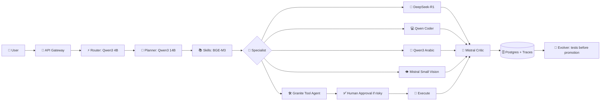

# 🧠 Hermes Agent — Open Model Fleet & Internal Agent Chain

**Project owner:** Ahmed MO Kireldin  
**Project website:** [Ahmedmokireldin.online](https://Ahmedmokireldin.online)

> Hermes Agent is an independent self-hosted project owned by **Ahmed MO Kireldin**. Model names, weights, trademarks, and third-party licenses remain with their respective owners.

## 🎯 Purpose of this layer

This layer adds a self-hosted open-weight model fleet and a clear internal handoff sequence between agents. The entire fleet does not need to stay in memory at the same time; choose a profile based on hardware, latency, and quality requirements.

## ⚖️ Open source versus open weights

- **Open source:** A model may use a recognized license such as Apache-2.0 or MIT, but the exact checkpoint terms still apply.
- **Open weights:** The weights are available to download and run, but the license may include additional conditions.
- **Non-commercial:** Some models, including certain Aya Expanse checkpoints, may restrict commercial use. Do not use them in a paid service before reviewing the exact model card.
- Availability on Ollama or Hugging Face does not automatically grant every possible usage right.

## 🧩 Recommended profiles

| Profile | Best for | Main lineup |
|---|---|---|
| `lite` | One machine or limited memory | Qwen3 4B/8B, Qwen Coder 7B, Granite 8B |
| `balanced` | Medium GPU server | Qwen3 14B, DeepSeek-R1 Distill 14B, Mistral Small 3.1 24B |
| `quality` | Strong GPU or multiple servers | Qwen3 32B, DeepSeek-R1 Distill 32B, Qwen Coder 32B |

## 🧭 Agent roles

| Role | Preferred model | Alternative | Purpose |
|---|---|---|---|
| Router | Qwen3 4B | Small Gemma | Fast request classification |
| Planner | Qwen3 14B/32B | Mistral Small 3.1 | Planning and agent coordination |
| Reasoner | DeepSeek-R1 Distill 14B/32B | Qwen3 Thinking | Math, logic, and deep reasoning |
| Coder | Qwen2.5-Coder 7B/14B/32B | Qwen3 | Code generation, testing, and debugging |
| Arabic | Qwen3 8B/14B | Aya Expanse 8B* | Arabic and customer messaging |
| Vision | Mistral Small 3.1 24B | Multimodal Gemma | Images and documents |
| Tools | Granite 3.3 8B | Qwen3 | Structured tool invocation |
| Critic | Mistral Small 3.1 24B | Granite 3.3 | Independent multidimensional evaluation |
| Embeddings | BGE-M3 | EmbeddingGemma | Arabic and multilingual skill retrieval |

`*` Aya Expanse is a conditional/non-commercial option depending on the exact checkpoint license.

## 🔁 Internal agent sequence



## 🔁 Agent handoff contract

Every agent receives a normalized JSON envelope:

```json
{
  "task_id": "uuid",
  "role": "coder",
  "input": "untrusted user task",
  "context": [],
  "skills": [],
  "budget": {"seconds": 120, "tokens": 4096, "tool_calls": 6},
  "allowed_tools": ["read_file", "write_file"],
  "previous_outputs": []
}
```

It returns:

```json
{
  "task_id": "uuid",
  "status": "complete",
  "answer": "...",
  "tool_calls": [],
  "evidence": [],
  "handoff": null,
  "needs_approval": false
}
```

The model cannot grant itself new tools. The policy layer decides whether a tool call is allowed.

## 🧬 Safe self-improvement

1. Collect low-quality tasks.
2. Extract failure causes.
3. Propose a prompt or skill candidate.
4. Test against the `dev` set.
5. Test against a hidden `holdout` set.
6. Run a limited canary rollout.
7. Promote the version or roll it back.

Model weights and core system code are never modified automatically. Fine-tuning and LoRA are separate procedures that require human review.

## 📦 Running the fleet

```bash
# Select a profile and pull the models
PROFILE=lite ./scripts-pull-models.sh

# Review the configuration
cat config/models.open.yaml

# Start the system
cp .env.example .env
docker compose up --build
```

## 🔗 Official sources

- [Qwen3 official release](https://qwenlm.github.io/blog/qwen3/)
- [DeepSeek-R1 official release](https://api-docs.deepseek.com/news/news250120)
- [Mistral Small 3.1](https://mistral.ai/news/mistral-small-3-1)
- [Google Gemma documentation](https://ai.google.dev/gemma/docs)
- [Qwen2.5-Coder GitHub](https://github.com/QwenLM/Qwen2.5-Coder)
- [IBM Granite 3.3 model card](https://huggingface.co/ibm-granite/granite-3.3-8b-instruct)
- [Aya Expanse model card](https://huggingface.co/CohereForAI/aya-expanse-8b)
- [BGE-M3 model card](https://huggingface.co/BAAI/bge-m3)

## © Ownership

© 2026 Ahmed MO Kireldin. Hermes Agent project documentation and integration code are attributed to the project owner above. Third-party models and libraries are governed by their own licenses.

## 📞 Official owner contact

**Owner:** Ahmed MO Kireldin  
**Website:** [Ahmedmokireldin.online](https://Ahmedmokireldin.online)  
**Phone:** `+201012025650`  
**Phone:** `+201006334062`  
**Email:** [Ahmedmokireldin.online@gmail.com](mailto:Ahmedmokireldin.online@gmail.com)

These details are published at the project owner's request as an official trust and contact reference.
