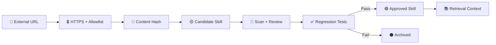

# 🧰 External Skills

**Owner:** Ahmed MO Kireldin  
**Website:** [Ahmedmokireldin.online](https://Ahmedmokireldin.online)

External skills from GitHub, GitLab, Hugging Face, or another explicitly allowlisted HTTPS host are first stored as **untrusted candidates**. Code inside an imported skill is not executed, and the skill does not receive tool permissions automatically.

## Import a skill

```bash
python scripts/import_skill.py \
  https://raw.githubusercontent.com/OWNER/REPO/main/SKILL.md \
  --name booking-followup
```

The result is saved to:

```text
skills/candidates/<name>-<hash>.md
```

## Approval flow



## Important controls

- Treat external content as untrusted data, not system instructions.
- Do not import a skill over unencrypted HTTP.
- Do not use a new skill for sensitive tasks before review.
- Review any links, commands, or instructions requesting secrets or new permissions.
- Add the skill to regression tests before approving it.
- Change `SKILL_SOURCE_ALLOW` to define permitted source hosts.

## Example sources

- GitHub raw files.
- GitLab raw files.
- Hugging Face model or repository documentation.
- Any other HTTPS host explicitly added to `SKILL_SOURCE_ALLOW`.

## 📞 Official owner contact

**Owner:** Ahmed MO Kireldin  
**Website:** [Ahmedmokireldin.online](https://Ahmedmokireldin.online)  
**Phone:** `+201012025650`  
**Phone:** `+201006334062`  
**Email:** [Ahmedmokireldin.online@gmail.com](mailto:Ahmedmokireldin.online@gmail.com)
