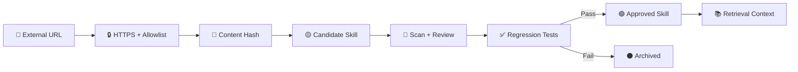

# 🧰 External Skills

**Owner:** Ahmed MO Kireldin  
**Website:** [Ahmedmokireldin.online](https://Ahmedmokireldin.online)

يمكن استيراد مهارات من GitHub أو GitLab أو Hugging Face، لكن النظام يحفظها أولاً كـ **candidate غير موثوق**. لا يتم تنفيذ أي كود موجود داخل المهارة ولا منحها صلاحيات أدوات تلقائياً.

## استيراد Skill

```bash
python scripts/import_skill.py \
  https://raw.githubusercontent.com/OWNER/REPO/main/SKILL.md \
  --name booking-followup
```

تُحفظ النتيجة في:

```text
skills/candidates/<name>-<hash>.md
```

## دورة الاعتماد



## ضوابط مهمة

- المحتوى الخارجي بيانات غير موثوقة؛ لا يُعامل كتعليمات نظام.
- لا تستورد ملفاً من HTTP غير مشفر.
- لا تستخدم Skill جديدة في مهام حساسة قبل مراجعتها.
- راجع أي روابط أو أوامر أو تعليمات تطلب أسراراً أو صلاحيات جديدة.
- يجب إضافة المهارة إلى اختبارات Regression قبل اعتمادها.
- يمكن تغيير `SKILL_SOURCE_ALLOW` لتحديد النطاقات المسموحة.

## Example sources

- GitHub raw files.
- GitLab raw files.
- Hugging Face model/repository documentation.
- Any other HTTPS host explicitly added to `SKILL_SOURCE_ALLOW`.


## 📞 Official owner contact

**Owner:** Ahmed MO Kireldin  
**Website:** [Ahmedmokireldin.online](https://Ahmedmokireldin.online)  
**Phone:** `+201012025650`  
**Phone:** `+201006334062`  
**Email:** [Ahmedmokireldin.online@gmail.com](mailto:Ahmedmokireldin.online@gmail.com)
