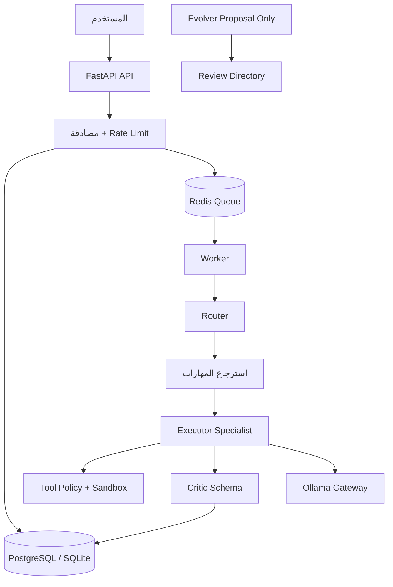
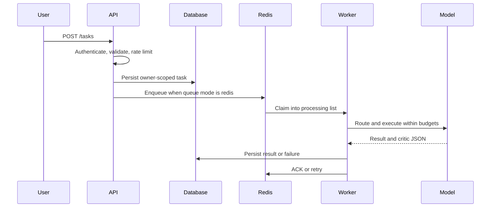
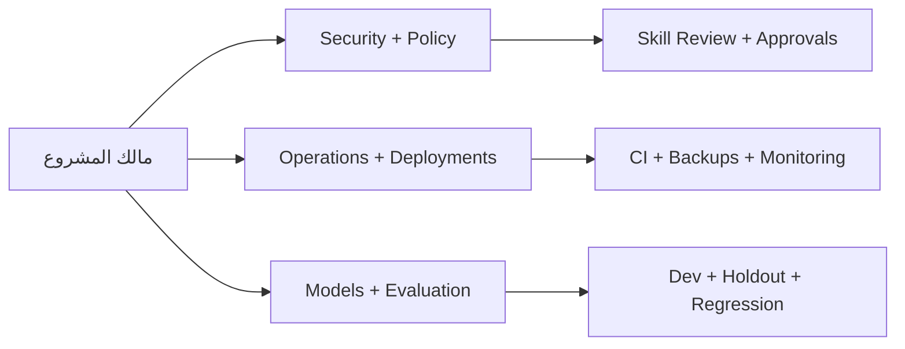

# المعمارية — Hermes Agent

## نظرة عامة

Hermes Agent منصة محلية متعددة الوكلاء تستقبل المهمة من FastAPI، تحفظها في قاعدة البيانات، ثم تنفذها inline أو عبر Redis Worker. يختار Router الدور المناسب، ويعمل Specialist على المهمة، ثم يراجع Critic النتيجة قبل حفظ الحالة والتتبع.

## المكونات

| المكون | المسؤولية |
|---|---|
| FastAPI | المصادقة والتحقق وإنشاء المهام وقراءة المهام المملوكة |
| SQLAlchemy | حفظ المهام والتتبعات والتواريخ والفهارس |
| Redis | طابور المهام وprocessing list وACK |
| Worker | تنفيذ المهام بمهلة وإعادة محاولة وحد أقصى |
| Router | تحديد الدور المتخصص |
| Executor | تشغيل النموذج مع prompt boundaries |
| Tools | ملفات workspace وPython وHTTP وWebhook بضوابط |
| Critic | تحليل منظم عبر Pydantic |
| Evolver | إنشاء proposal فقط داخل `review/` |

## دورة المهمة

## تنظيم المسؤوليات

## حدود الثقة

محتوى المستخدم والويب والمهارات ومخرجات النماذج غير موثوق. طبقة Policy هي الوحيدة التي تمنح الأدوات، ومالك المهمة هو الوحيد الذي يستطيع قراءة نتيجتها عبر API key نفسه. لا تعد هذه النسخة Sandbox قوياً لتشغيل كود عدائي.

## نقاط التطوير التالية

أضف visibility timeout وreaper للطابور، redaction قبل traces، metrics وOpenTelemetry، pgvector وreranker، sandbox لكل مهمة، وواجهة موافقة بشرية قبل الأفعال الخارجية غير القابلة للعكس.
