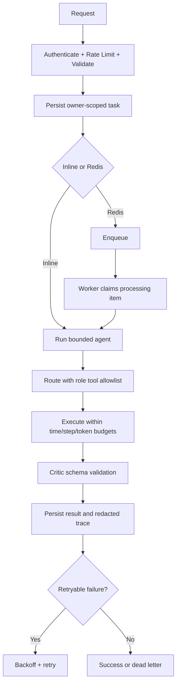

# Hermes Agent Security and DevOps Audit

**Branch:** `hardening/audit-1`  
**Scope:** FastAPI, async SQLAlchemy, Redis queue, Ollama gateway, tools, external skills, Docker, CI, and documentation.

## Executive summary

The baseline was small and functional but not production-ready. The original test suite passed **4 tests**. The audit branch adds authentication enforcement, task ownership, rate limiting, request validation, safer tools, SSRF controls, worker-side webhook enforcement, explicit skill approval, Docker hardening, Redis authentication, environment propagation, Alembic scaffolding, CI, and expanded tests.

This branch is a hardening increment, not a claim of complete production readiness. Redis crash recovery and DNS pinning require a full integration test against the target deployment environment, and the Python subprocess is still not a strong sandbox.

## Architecture map

| Area | Current implementation | Entry point / process |
|---|---|---|
| HTTP API | FastAPI in `app/api.py` | API container or Uvicorn |
| Persistence | Async SQLAlchemy in `app/db.py` | API and worker |
| Queue | Redis reliable list with processing list and ACK | API enqueues; worker consumes |
| Agent chain | Router → executor → Critic in `app/agent.py` | API inline or worker |
| Tools | `app/tools.py` | Called by agent/worker; security settings are shared from `app/config.py` |
| Skill importer | HTTPS fetch, host allowlist, bounded streaming, candidate storage in `app/skills.py` | CLI under `scripts/` |
| Models | Ollama gateway in `app/llm.py`; profiles in `config/models.open.yaml` | API/worker |
| Self-improvement | Proposal-only Evolver in `app/evolver.py` | Review directory only |

## Baseline and after

| Check | Baseline | Hardening branch |
|---|---:|---:|
| Existing tests | 4 passed | Re-run required after dependency installation |
| Auth with empty/placeholder keys | Allowed | Refuses startup outside `ENV=dev` |
| Task ownership | None | Owner-scoped by API key |
| Idempotency | Global key and race returned 409 | Owner-scoped insert/fetch fallback |
| Webhook enforcement | API settings could differ from worker behavior | Shared settings and worker test |
| Skills | Download-after-size-check, no approval | Streaming limit, pinned source check, explicit CLI approval |
| Containers | Root, exposed database ports, plaintext defaults | Non-root, no DB/Redis host ports, healthchecks, read-only FS, limits |

## Findings table

| ID | Severity | Location | Finding | Fix | Test / verification |
|---|---|---|---|---|---|
| SEC-01 | Critical | `app/config.py` | Production could start with empty or placeholder API keys | Startup refusal unless `ENV=dev`; constant-time comparison | `tests/test_api.py` |
| SEC-02 | High | `docker-compose.yml` | Secrets, DB/Redis ports, and settings were unsafe or not propagated | `.env`, Redis auth, no DB/Redis ports, both services receive security settings | `docker compose config -q` |
| SEC-03 | High | `app/tools.py` | Path traversal, symlinks, resource exhaustion, and SSRF coverage were incomplete | Containment, separator/null checks, file limits, rlimits, public IP checks, no redirects | `tests/test_tools.py` |
| SEC-04 | High | `app/skills.py` | Skill downloads were unbounded during transfer and had no approval gate | Streaming size bound, content type, SHA-256, candidate/approved lifecycle | `tests/test_skills.py` |
| SEC-05 | High | `app/api.py`, `app/db.py` | Any authenticated user could read another task | `owner_key` filter on reads and owner-scoped idempotency | `tests/test_api.py` |
| REL-01 | High | `app/queue.py`, `app/worker.py` | BLPOP could lose tasks on worker crash | Processing list and ACK semantics; full visibility-timeout integration remains open | Code review; integration test recommended |
| AI-01 | High | `app/agent.py` | Critic JSON was accepted without schema and prompt boundaries were weak | Pydantic schema, delimiters, explicit role tool allowlists and budgets | Unit coverage recommended |
| OPS-01 | Medium | `Dockerfile`, Compose | Containers ran as root and lacked resource/startup controls | Non-root user, healthchecks, read-only FS, tmpfs, caps, limits, healthy dependencies | `docker build`, Compose config |
| OPS-02 | Medium | DB startup | Production used `create_all` | Dev/test-only creation and initial Alembic migration | `alembic/` |
| DEV-01 | Medium | repository layout | Documentation and scripts were in the root while README referenced subdirectories | Moved to `docs/` and `scripts/`; links updated | `find`, link scan |
| DEV-02 | Low | CI | No automated lint/security/build gate | GitHub Actions for Ruff, pytest, pip-audit, Compose config, Docker build | `.github/workflows/ci.yml` |

## Trust boundaries

1. API input is untrusted and is bounded by Pydantic and request-size middleware.
2. Model output and fetched content are data, not instructions; prompts use explicit data delimiters.
3. Tools have role-based allowlists and workspace/network controls.
4. External skills remain candidates until a human runs `scripts/approve_skill.py`.
5. Customer-facing webhooks remain an explicit allowlist and should have an approval layer for irreversible actions.

## Operational workflow

## Residual risks

The Python executor is resource-limited but is **not a strong sandbox**. For hostile code, enable a per-task container or gVisor/Firecracker design with `--network none`, read-only root filesystem, dropped capabilities, and an explicit workspace mount. The current HTTP client pre-resolves destinations and disables redirects; a production deployment should add a pinned-IP transport and an integration corpus for DNS rebinding and IPv4-mapped IPv6 cases. The list queue needs a visibility-timeout reaper and a dead-letter integration test. Token accounting is not yet provider-backed; `MAX_TASK_TOKENS` should be enforced using actual usage metadata before production use.

## Production checklist

- Set long random `API_KEYS`, `POSTGRES_PASSWORD`, and `REDIS_PASSWORD` in a secret manager.
- Set `ENV=prod`, `MOCK_LLM=false`, and a reachable `OLLAMA_URL`.
- Run `alembic upgrade head` before starting API and worker.
- Do not publish PostgreSQL or Redis ports to the host.
- Put API behind TLS, trusted-host validation, and an external rate limiter.
- Add backups, restore tests, queue visibility reaping, and alerting.
- Review every external skill and model license.
- Decide whether personal phone numbers should remain in the public README and landing page.

## Owner decisions required

1. **License:** resolved by the owner as **Proprietary — All Rights Reserved**. See `LICENSE`.
2. **Personal contact details:** the current project history explicitly requested the phone numbers and email, so they remain present. Confirm whether they should stay in the public README and HTML landing page.
3. **Docker-per-task sandbox:** decide whether to enable it by default for untrusted Python execution.
