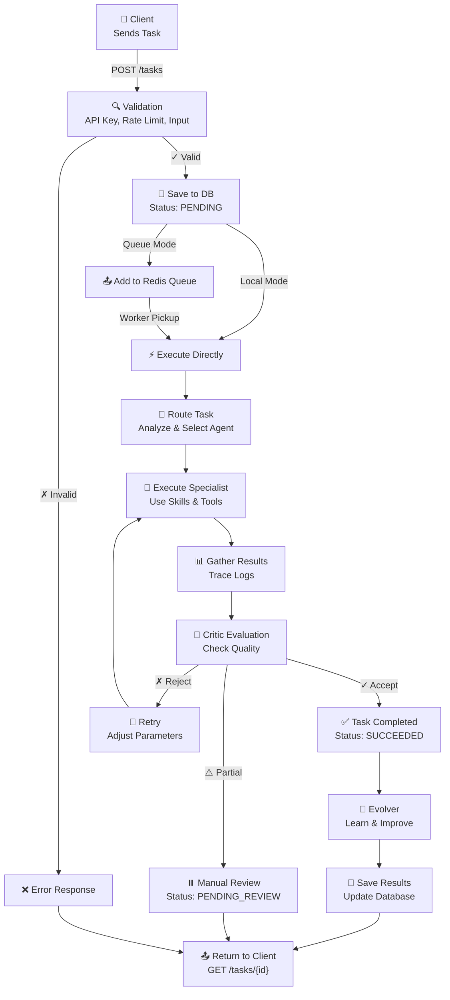
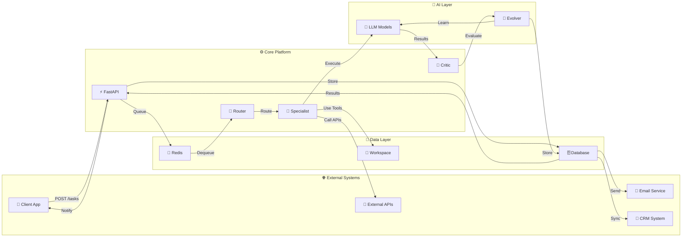

# 🚀 Hermes Agent - System Architecture & Design

> A beautiful visual representation of the multi-agent AI platform architecture with workflow scenarios

---

## 🏗️ System Architecture Overview

```
╔═══════════════════════════════════════════════════════════════════════════╗
║                                                                           ║
║              🎯 HERMES AGENT - MULTI-AGENT PLATFORM                      ║
║                                                                           ║
║  Self-hosted • Open-weight models • Agent routing • Safe self-improvement ║
║                                                                           ║
╚═══════════════════════════════════════════════════════════════════════════╝

┏━━━━━━━━━━━━━━━━━━━━━━━━━━━━━━━━━━━━━━━━━━━━━━━━━━━━━━━━━━━━━━━━━━━━━━━━┓
┃                   👥 EXTERNAL INTERFACE LAYER                           ┃
┃                     (User & System Access)                              ┃
┣━━━━━━━━━━━━━━━━━━━━━━━━━━━━━━━━━━━━━━━━━━━━━━━━━━━━━━━━━━━━━━━━━━━━━━━━┫
┃                                                                         ┃
┃  📱 Mobile App    🌐 Web Dashboard    🔌 REST API    🔗 External API  ┃
┃                                                                         ┃
┗━━━━━━━━━━━━━━━━━━━━━━━━━━━━━━━━━━━━━━━━━━━━━━━━━━━━━━━━━━━━━━━━━━━━━━━━┛
                              ↓ HTTP/JSON
┏━━━━━━━━━━━━━━━━━━━━━━━━━━━━━━━━━━━━━━━━━━━━━━━━━━━━━━━━━━━━━━━━━━━━━━━━┓
┃                   🔐 SECURITY & AUTH LAYER                              ┃
┃                                                                         ┃
┃  ✓ API Key Verification   ✓ Rate Limiting   ✓ TLS Encryption          ┃
┃  ✓ Token Validation       ✓ SSRF Protection   ✓ Input Sanitization    ┃
┃                                                                         ┃
┗━━━━━━━━━━━━━━━━━━━━━━━━━━━━━━━━━━━━━━━━━━━━━━━━━━━━━━━━━━━━━━━━━━━━━━━━┛
                              ↓
┏━━━━━━━━━━━━━━━━━━━━━━━━━━━━━━━━━━━━━━━━━━━━━━━━━━━━━━━━━━━━━━━━━━━━━━━━┓
┃              ⚡ FASTAPI APPLICATION LAYER (Core API)                   ┃
┃                                                                         ┃
┃  POST   /tasks          Create new task                                ┃
┃  GET    /tasks/{id}     Get task status & results                      ┃
┃  GET    /tasks          List all tasks                                 ┃
┃  GET    /health         System health check                            ┃
┃  POST   /skills         Import external skills                         ┃
┃  GET    /skills         List available skills                          ┃
┃                                                                         ┃
┗━━━━━━━━━━━━━━━━━━━━━━━━━━━━━━━━━━━━━━━━━━━━━━━━━━━━━━━━━━━━━━━━━━━━━━━━┛
                    ↓ Task Queue / Direct Execution
┏━━━━━━━━━━━━━━━━━━━━━━━━━━━━━━━━━━━━━━━━━━━━━━━━━━━━━━━━━━━━━━━━━━━━━━━━┓
┃            🎛️ TASK ORCHESTRATION & ROUTING LAYER                       ┃
┃                                                                         ┃
┃  ┌─────────────────────────────────────────────────────────┐          ┃
┃  │  🔄 QUEUE MANAGEMENT SYSTEM                             │          ┃
┃  │                                                         │          ┃
┃  │  ▪ LOCAL MODE: Inline execution (Development)         │          ┃
┃  │    • No external dependencies                          │          ┃
┃  │    • Fast feedback loop                                │          ┃
┃  │    • Perfect for testing                               │          ┃
┃  │                                                         │          ┃
┃  │  ▪ REDIS MODE: Distributed queue (Production)         │          ┃
┃  │    • Scalable to multiple workers                      │          ┃
┃  │    • Long-running task support                         │          ┃
┃  │    • Reliability & persistence                         │          ┃
┃  │                                                         │          ┃
┃  └─────────────────────────────────────────────────────────┘          ┃
┃                                                                         ┃
┗━━━━━━━━━━━━━━━━━━━━━━━━━━━━━━━━━━━━━━━━━━━━━━━━━━━━━━━━━━━━━━━━━━━━━━━━┛
                              ↓
┏━━━━━━━━━━━━━━━━━━━━━━━━━━━━━━━━━━━━━━━━━━━━━━━━━━━━━━━━━━━━━━━━━━━━━━━━┓
┃            🧠 INTELLIGENT TASK EXECUTION ENGINE                         ┃
┃                                                                         ┃
┃  ┌──────────────────────────────────────────────────────┐             ┃
┃  │  🔐 ROUTER (Task Analyzer)                           │             ┃
┃  │  • Analyzes task type & complexity                   │             ┃
┃  │  • Selects appropriate specialist agent              │             ┃
┃  │  • Chooses optimal LLM profile                       │             ┃
┃  │  • Routes to relevant skill set                      │             ┃
┃  └──────────────────────────────────────────────────────┘             ┃
┃                          ↓                                             ┃
┃  ┌──────────────────────────────────────────────────────┐             ┃
┃  │  🧩 SPECIALIST EXECUTOR                              │             ┃
┃  │                                                      │             ┃
┃  │  Types of Specialists:                              │             ┃
┃  │  • 💼 Business Specialist (Sales, Marketing)       │             ┃
┃  │  • 👥 Customer Service Specialist                  │             ┃
┃  │  • 📊 Data Analysis Specialist                     │             ┃
┃  │  • 💻 Software Development Specialist              │             ┃
┃  │  • 🔒 Security Specialist                          │             ┃
┃  │  • 📝 Content Creation Specialist                  │             ┃
┃  │  • 🎯 Product Manager Specialist                  │             ┃
┃  │                                                      │             ┃
┃  └──────────────────────────────────────────────────────┘             ┃
┃                          ↓                                             ┃
┃  ┌──────────────────────────────────────────────────────┐             ┃
┃  │  📚 SKILLS LIBRARY (Reusable Capabilities)           │             ┃
┃  │                                                      │             ┃
┃  │  • Text Processing & NLP                             │             ┃
┃  │  • Data Analysis & Statistics                        │             ┃
┃  │  • Database Queries & Operations                     │             ┃
┃  │  • External API Integration                          │             ┃
┃  │  • File Management & Processing                      │             ┃
┃  │  • Web Scraping & Data Collection                    │             ┃
┃  │  • Code Generation & Execution                       │             ┃
┃  │  • Email & Notifications                             │             ┃
┃  │                                                      │             ┃
┃  └──────────────────────────────────────────────────────┘             ┃
┃                          ↓                                             ┃
┃  ┌──────────────────────────────────────────────────────┐             ┃
┃  │  🛠️ CONSTRAINED TOOLS (Secure & Safe)               │             ┃
┃  │                                                      │             ┃
┃  │  • 📁 File Workspace (Isolated)                    │             ┃
┃  │  • 🐍 Python Executor (Timeout Protection)          │             ┃
┃  │  • 🌐 HTTP Requests (Allowlist Only)               │             ┃
┃  │  • 🔔 Webhook Manager (Restricted)                 │             ┃
┃  │  • 🗄️ Database Interface (Query Sandboxing)        │             ┃
┃  │                                                      │             ┃
┃  └──────────────────────────────────────────────────────┘             ┃
┃                          ↓                                             ┃
┃  ┌──────────────────────────────────────────────────────┐             ┃
┃  │  🔎 CRITIC (Quality Evaluator)                       │             ┃
┃  │                                                      │             ┃
┃  │  Decision Engine:                                    │             ┃
┃  │  ✓ ACCEPTED  → Output is valid                       │             ┃
┃  │  ✗ REJECTED  → Output fails validation               │             ┃
┃  │  🔄 RETRY    → Re-execute with adjustments           │             ┃
┃  │                                                      │             ┃
┃  │  Validation Checks:                                  │             ┃
┃  │  • Content accuracy & correctness                    │             ┃
┃  │  • Requirement compliance                            │             ┃
┃  │  • Security & safety standards                       │             ┃
┃  │  • Response quality & completeness                   │             ┃
┃  │                                                      │             ┃
┃  └──────────────────────────────────────────────────────┘             ┃
┃                          ↓                                             ┃
┃  ┌──────────────────────────────────────────────────────┐             ┃
┃  │  🔄 EVOLVER (Self-Improvement Engine)                │             ┃
┃  │                                                      │             ┃
┃  │  Learning from Results:                              │             ┃
┃  │  • Strategy optimization                             │             ┃
┃  │  • Skill improvement                                 │             ┃
┃  │  • Parameter tuning                                  │             ┃
┃  │  • Predictive issue detection                        │             ┃
┃  │  • Pattern recognition                               │             ┃
┃  │                                                      │             ┃
┃  └──────────────────────────────────────────────────────┘             ┃
┃                                                                         ┃
┗━━━━━━━━━━━━━━━━━━━━━━━━━━━━━━━━━━━━━━━━━━━━━━━━━━━━━━━━━━━━━━━━━━━━━━━━┛
                              ↓
┏━━━━━━━━━━━━━━━━━━━━━━━━━━━━━━━━━━━━━━━━━━━━━━━━━━━━━━━━━━━━━━━━━━━━━━━━┓
┃              🧠 LANGUAGE MODEL LAYER (LLM Intelligence)                ┃
┃                                                                         ┃
┃  ┌──────────────────────────────────────────────────────┐             ┃
┃  │  Mock LLM (Testing & Development)                   │             ┃
┃  │  • Pre-programmed responses                         │             ┃
┃  │  • No external dependencies                         │             ┃
┃  │  • Perfect for unit testing                         │             ┃
┃  └──────────────────────────────────────────────────────┘             ┃
┃                                                                         ┃
┃  ┌──────────────────────────────────────────────────────┐             ┃
┃  │  Ollama (Open-Weight Models)                        │             ┃
┃  │                                                      │             ┃
┃  │  📦 Lite Profile (Resource Constrained)            ┃
┃  │     Qwen 4B/8B, Granite 8B                         │             ┃
┃  │     → Single machine deployment                    │             ┃
┃  │                                                      │             ┃
┃  │  ⚖️ Balanced Profile (Recommended)                 ┃
┃  │     Qwen 14B, DeepSeek-R1 14B, Mistral 24B        │             ┃
┃  │     → Medium GPU server                            │             ┃
┃  │                                                      │             ┃
┃  │  🚀 Quality Profile (Premium Performance)          ┃
┃  │     Qwen 32B, DeepSeek-R1 32B, Coder 32B          │             ┃
┃  │     → Strong GPU or multiple servers               │             ┃
┃  │                                                      │             ┃
┃  └──────────────────────────────────────────────────────┘             ┃
┃                                                                         ┃
┗━━━━━━━━━━━━━━━━━━━━━━━━━━━━━━━━━━━━━━━━━━━━━━━━━━━━━━━━━━━━━━━━━━━━━━━━┛
                              ↓
┏━━━━━━━━━━━━━━━━━━━━━━━━━━━━━━━━━━━━━━━━━━━━━━━━━━━━━━━━━━━━━━━━━━━━━━━━┓
┃              🗄️ STORAGE & DATA PERSISTENCE LAYER                       ┃
┃                                                                         ┃
┃  ┌──────────────────────────────────────────────────────┐             ┃
┃  │  📊 DATABASE (Task & Result Storage)                │             ┃
┃  │                                                      │             ┃
┃  │  Development: SQLite (Lightweight)                  │             ┃
┃  │  • Zero configuration                               │             ┃
┃  │  • Fast development cycles                         │             ┃
┃  │                                                      │             ┃
┃  │  Production: PostgreSQL (Enterprise-Grade)         │             ┃
┃  │  • High performance & scalability                  │             ┃
┃  │  • Advanced features & reliability                 │             ┃
┃  │  • Multiple backup strategies                      │             ┃
┃  │                                                      │             ┃
┃  │  Core Tables:                                       │             ┃
┃  │  • Tasks (execution history)                        │             ┃
┃  │  • Traces (detailed execution logs)                 │             ┃
┃  │  • Skills (imported capabilities)                   │             ┃
┃  │  • Users (access management)                        │             ┃
┃  │  • Sessions (interaction history)                   │             ┃
┃  │                                                      │             ┃
┃  └──────────────────────────────────────────────────────┘             ┃
┃                                                                         ┃
┃  ┌──────────────────────────────────────────────────────┐             ┃
┃  │  📁 FILE WORKSPACE (Isolated Storage)               │             ┃
┃  │                                                      │             ┃
┃  │  • Secure file execution sandbox                    │             ┃
┃  │  • Temporary file management                        │             ┃
┃  │  • Python script isolation                          │             ┃
┃  │  • Automatic cleanup                                │             ┃
┃  │                                                      │             ┃
┃  └──────────────────────────────────────────────────────┘             ┃
┃                                                                         ┃
┃  ┌──────────────────────────────────────────────────────┐             ┃
┃  │  🔄 REDIS (Distributed Cache & Queue)              │             ┃
┃  │                                                      │             ┃
┃  │  • Task queue storage                               │             ┃
┃  │  • Inter-worker communication                       │             ┃
┃  │  • Result caching                                   │             ┃
┃  │  • Session management                               │             ┃
┃  │                                                      │             ┃
┃  └──────────────────────────────────────────────────────┘             ┃
┃                                                                         ┃
┗━━━━━━━━━━━━━━━━━━━━━━━━━━━━━━━━━━━━━━━━━━━━━━━━━━━━━━━━━━━━━━━━━━━━━━━━┛
```

---

## 📊 Task Lifecycle Flow (Mermaid Diagram)



---

## 🎯 Use Case Scenarios

### **Scenario 1: Customer Aggregation & Management**

```
┌────────────────────────────────────────────────────────────────┐
│  📋 SCENARIO: Automated Customer Data Aggregation              │
└────────────────────────────────────────────────────────────────┘

OBJECTIVE:
└─ Collect customer data from multiple sources and create 
   unified customer profiles

WORKFLOW:
┌────────────────────────────────────���─────────────────────────┐
│                                                              │
│  1️⃣ INPUT TASK                                              │
│     • Customer ID: #12345                                    │
│     • Data Sources: Email, CRM, Social Media, Tickets      │
│                                                              │
│     │                                                        │
│     ▼                                                        │
│                                                              │
│  2️⃣ ROUTER ANALYSIS                                         │
│     • Task Type: Data Aggregation                           │
│     • Selected Agent: Data Analysis Specialist             │
│     • LLM Profile: Balanced (Qwen 14B)                      │
│                                                              │
│     │                                                        │
│     ▼                                                        │
│                                                              │
│  3️⃣ SPECIALIST EXECUTION                                    │
│     │                                                        │
│     ├─ Skill 1: Email Data Extraction                       │
│     │  └─ Tool: Query Email API (allowed source)           │
│     │  └─ Result: 15 emails from customer                   │
│     │                                                        │
│     ├─ Skill 2: CRM Integration                             │
│     │  └─ Tool: CRM API Call (allowlist)                   │
│     │  └─ Result: Customer history, interactions           │
│     │                                                        │
│     ├─ Skill 3: Social Media Analysis                       │
│     │  └─ Tool: Public data crawling                        │
│     │  └─ Result: Social presence, engagement              │
│     │                                                        │
│     └─ Skill 4: Support Ticket Analysis                     │
│        └─ Tool: Database Query                              │
│        └─ Result: 12 tickets, 3 unresolved issues           │
│                                                              │
│     │                                                        │
│     ▼                                                        │
│                                                              │
│  4️⃣ DATA SYNTHESIS                                          │
│     • Merge all data sources                                │
│     • Deduplicate and normalize                             │
│     • Create unified profile                                │
│     • Generate insights                                     │
│                                                              │
│     │                                                        │
│     ▼                                                        │
│                                                              │
│  5️⃣ CRITIC EVALUATION                                       │
│     ✓ Data consistency check                                │
│     ✓ Completeness verification                             │
│     ✓ PII handling compliance                               │
│     ✓ Accuracy validation                                   │
│                                                              │
│     │                                                        │
│     ▼                                                        │
│                                                              │
│  6️⃣ OUTPUT RESULTS                                          │
│     {                                                        │
│       "customer_id": "#12345",                              │
│       "name": "John Doe",                                   │
│       "email": "john@example.com",                          │
│       "company": "TechCorp",                                │
│       "total_interactions": 27,                             │
│       "open_issues": 3,                                     │
│       "satisfaction_score": 4.2,                            │
│       "recommended_actions": [...]                          │
│     }                                                        │
│                                                              │
└──────────────────────────────────────────────────────────────┘

BENEFITS:
✨ Real-time customer view
✨ Automated data gathering
✨ Reduced manual work by 80%
✨ Better customer insights
✨ Improved response times
```

---

### **Scenario 2: Browser-Based Task Execution & Web Querying**

```
┌────────────────────────────────────────────────────────────────┐
│  🌐 SCENARIO: Automated Web Research & Data Collection         │
└────────────────────────────────────────────────────────────────┘

OBJECTIVE:
└─ Research competitor pricing, features, and market positioning
   using web scraping and analysis

WORKFLOW:
┌──────────────────────────────────────────────────────────────┐
│                                                              │
│  1️⃣ INPUT TASK                                              │
│     • Task: "Analyze top 5 competitors in SaaS market"      │
│     • Target: Pricing models, features, customers          │
│     • Output: Competitive analysis report                   │
│                                                              │
│     │                                                        │
│     ▼                                                        │
│                                                              │
│  2️⃣ ROUTER ANALYSIS                                         │
│     • Task Type: Web Research & Analysis                    │
│     • Selected Agent: Business Intelligence Specialist     │
│     • LLM Profile: Quality (Qwen 32B)                       │
│                                                              │
│     │                                                        │
│     ▼                                                        │
│                                                              │
│  3️⃣ SPECIALIST EXECUTION                                    │
│     │                                                        │
│     ├─ Skill 1: Company Identification                      │
│     │  └─ Tool: Google Search API (safe source)            │
│     │  └─ Result: Competitor URLs identified               │
│     │                                                        │
│     ├─ Skill 2: Website Content Scraping                    │
│     │  └─ Tool: HTTP Requests (allowlist)                  │
│     │  └─ Process 5 websites                               │
│     │  └─ Extract pricing pages                             │
│     │                                                        │
│     ├─ Skill 3: Data Parsing & Extraction                   │
│     │  └─ Tool: Python Parser                               │
│     │  └─ Extract features from HTML                        │
│     │  └─ Normalize pricing information                     │
│     │                                                        │
│     ├─ Skill 4: Pattern Recognition                         │
│     │  └─ Tool: NLP Analysis                                │
│     │  └─ Identify key features                             │
│     │  └─ Find market trends                                │
│     │                                                        │
│     └─ Skill 5: Report Generation                           │
│        └─ Tool: Template System                             │
│        └─ Create structured report                          │
│        └─ Add visualizations                                │
│                                                              │
│     │                                                        │
│     ▼                                                        │
│                                                              │
│  4️⃣ DATA SYNTHESIS                                          │
│     • Compare pricing strategies                            │
│     • Identify feature gaps                                 │
│     • Analyze customer segments                             │
│     • Generate recommendations                              │
│                                                              │
│     │                                                        │
│     ▼                                                        │
│                                                              │
│  5️⃣ CRITIC EVALUATION                                       │
│     ✓ Data freshness check (recency)                        │
│     ✓ Accuracy verification                                 │
│     ✓ Bias detection                                        │
│     ✓ Legal/ethical compliance                              │
│     ✓ Report completeness                                   │
│                                                              │
│     │                                                        │
│     ▼                                                        │
│                                                              │
│  6️⃣ OUTPUT REPORT                                           │
│     ┌─────────────────────────────────┐                    │
│     │ COMPETITIVE ANALYSIS REPORT     │                    │
│     ├─────────────────────────────────┤                    │
│     │                                 │                    │
│     │ Competitor 1: Company A         │                    │
│     │ └─ Pricing: $99-999/month       │                    │
│     │ └─ Key Features: [list]         │                    │
│     │ └─ Estimated Users: 50K+        │                    │
│     │                                 │                    │
│     │ [4 more competitors...]         │                    │
│     │                                 │                    │
│     │ KEY FINDINGS:                   │                    │
│     │ • Price range: $29-$999         │                    │
│     │ • Common features: [...]        │                    │
│     │ • Market gaps: [...]            │                    │
│     │ • Opportunities: [...]          │                    │
│     │                                 │                    │
│     └─────────────────────────────────┘                    │
│                                                              │
└──────────────────────────────────────────────────────────────┘

BENEFITS:
✨ Real-time market intelligence
✨ Automated competitor monitoring
✨ Data-driven decision making
✨ Reduced research time (24hrs → 2 minutes)
✨ Continuous market tracking
```

---

### **Scenario 3: Complex Multi-Step Business Process Automation**

```
┌────────────────────────────────────────────────────────────────┐
│  🎯 SCENARIO: End-to-End Sales Lead Processing                │
└────────────────────────────────────────────────────────────────┘

OBJECTIVE:
└─ Fully automated lead qualification, nurturing, and scoring
   with email outreach and CRM updates

WORKFLOW:
┌──────────────────────────────────────────────────────────────┐
│                                                              │
│  COMPLEX MULTI-AGENT ORCHESTRATION                          │
│  ═════════════════════════════════                          │
│                                                              │
│  INPUT: Raw lead from web form                              │
│  └─ Name: Jane Smith                                        │
│  └─ Email: jane@techcorp.io                                │
│  └─ Company: TechCorp Inc                                  │
│  └─ Interest: Enterprise solution                          │
│                                                              │
│     │                                                        │
│     ▼                                                        │
│                                                              │
│  📋 PHASE 1: LEAD QUALIFICATION (Sales Specialist)         │
│  ──────────────────────────────────────────────────        │
│                                                              │
│  Agent Actions:                                             │
│  1. Verify email address                                   │
│  2. Research company (public data)                         │
│  3. Check company size & industry fit                      │
│  4. Assess budget potential                                │
│  5. Calculate lead score                                   │
│                                                              │
│  Skills Used:                                               │
│  ├─ Email Validation Skill                                 │
│  ├─ Company Research Skill                                 │
│  ├─ Industry Analysis Skill                                │
│  └─ Lead Scoring Skill                                     │
│                                                              │
│  Tools Used:                                                │
│  ├─ HTTP API for company data                              │
│  ├─ Public database queries                                │
│  └─ Python scoring algorithm                               │
│                                                              │
│  Result: Lead Score 8.5/10 (High Priority)                │
│                                                              │
│     │                                                        │
│     ▼                                                        │
│                                                              │
│  ✉️ PHASE 2: PERSONALIZED OUTREACH (Content Specialist)    │
│  ─────────────────────────────────────────────────         │
│                                                              │
│  Agent Actions:                                             │
│  1. Analyze company website                                │
│  2. Identify key pain points                               │
│  3. Generate personalized email                            │
│  4. Add relevant case studies                              │
│  5. Create follow-up schedule                              │
│                                                              │
│  Skills Used:                                               │
│  ├─ Company Profile Analysis Skill                         │
│  ├─ Pain Point Detection Skill                             │
│  ├─ Email Personalization Skill                            │
│  └─ Content Recommendation Skill                           │
│                                                              │
│  Output Generated:                                          │
│  ┌─────────────────────────────────┐                      │
│  │ Subject: Solution for TechCorp's │                      │
│  │          Data Integration        │                      │
│  │                                 │                      │
│  │ Hi Jane,                         │                      │
│  │                                 │                      │
│  │ [Personalized content based on  │                      │
│  │  company analysis]              │                      │
│  │                                 │                      │
│  └─────────────────────────────────┘                      │
│                                                              │
│     │                                                        │
│     ▼                                                        │
│                                                              │
│  💼 PHASE 3: CRM INTEGRATION (Operations Specialist)        │
│  ───────────────────────────────────────────────           │
│                                                              │
│  Agent Actions:                                             │
│  1. Create lead record in CRM                              │
│  2. Assign to sales rep                                    │
│  3. Set follow-up reminders                                │
│  4. Link related opportunities                             │
│  5. Schedule calls                                         │
│                                                              │
│  Skills Used:                                               │
│  ├─ CRM Data Insertion Skill                               │
│  ├─ Sales Rep Assignment Skill                             │
│  └─ Task Scheduling Skill                                  │
│                                                              │
│  Tools Used:                                                │
│  ├─ CRM API (allowlist)                                    │
│  ├─ Calendar Integration                                   │
│  └─ Notification System                                    │
│                                                              │
│     │                                                        │
│     ▼                                                        │
│                                                              │
│  📊 PHASE 4: MONITORING & OPTIMIZATION (Evolver)           │
│  ────────────────────────────────────────────             │
│                                                              │
│  Continuous Learning:                                       │
│  • Track email open rates                                  │
│  • Monitor response patterns                               │
│  • Identify successful approaches                          │
│  • Optimize scoring algorithm                              │
│  • Improve personalization                                 │
│                                                              │
│     │                                                        │
│     ▼                                                        │
│                                                              │
│  ✅ FINAL OUTCOME                                           │
│  ─────────────────                                         │
│                                                              │
│  Lead: Jane Smith                                           │
│  Status: ✓ Qualified → CRM                                │
│  Score: 8.5/10                                             │
│  Next Step: Email sent + Call scheduled                    │
│  Time Taken: 3.2 minutes                                   │
│  (Manual process: ~30-45 minutes)                          │
│                                                              │
│  Savings: 90% time reduction                               │
│  Improved: Lead quality + Response time                    │
│                                                              │
└──────────────────────────────────────────────────────────────┘

ADVANCED FEATURES:
🎯 Multi-agent coordination
🎯 Conditional workflows
🎯 External API orchestration
🎯 Real-time data synchronization
🎯 Continuous learning & optimization
🎯 Fallback & error handling
🎯 Audit trail & compliance
```

---

## 🔄 Data Flow Diagram



---

## 🚀 Deployment Architecture

```
┌─────────────────────────────────────────────────────────────┐
│                    LOCAL DEVELOPMENT                        │
├─────────────────────────────────────────────────────────────┤
│                                                             │
│  Single Machine Setup:                                      │
│  • FastAPI + SQLite                                         │
│  • Mock LLM or Local Ollama                                │
│  • No Redis (inline execution)                             │
│  • Direct file workspace                                    │
│                                                             │
│  Performance: ~10-50 tasks/minute                          │
│                                                             │
└─────────────────────────────────────────────────────────────┘
                             ↓ Scale up
┌─────────────────────────────────────────────────────────────┐
│                    STAGING ENVIRONMENT                      │
├─────────────────────────────────────────────────────────────┤
│                                                             │
│  Docker Compose Stack:                                      │
│  • FastAPI (single instance)                               │
│  • PostgreSQL (replicated)                                 │
│  • Ollama (lite/balanced models)                           │
│  • Redis (single node)                                     │
│  • 2-5 worker containers                                   │
│                                                             │
│  Performance: ~100-500 tasks/minute                        │
│  Availability: 99.5%                                       │
│                                                             │
└─────────────────────────────────────────────────────────────┘
                             ↓ Scale up
┌─────────────────────────────────────────────────────────────┐
│                  PRODUCTION DEPLOYMENT                      │
├─────────────────────────────────────────────────────────────┤
│                                                             │
│  Kubernetes Cluster:                                        │
│  • FastAPI (3-5 replicas)                                 │
│  • PostgreSQL (HA cluster)                                │
│  • Ollama (distributed, multiple profiles)                │
│  • Redis Cluster (3+ nodes)                               │
│  • 10-50+ worker pods                                      │
│  • Prometheus + Grafana (monitoring)                       │
│  • Reverse proxy + TLS (security)                         │
│                                                             │
│  Performance: 1000-10000+ tasks/minute                    │
│  Availability: 99.95%+                                     │
│  Auto-scaling: Enabled                                     │
│                                                             │
└─────────────────────────────────────────────────────────────┘
```

---

## 🔐 Security Architecture

```
Layer 1: PERIMETER SECURITY
├─ TLS/HTTPS encryption
├─ Reverse proxy (nginx/caddy)
├─ DDoS protection
└─ WAF rules

    ↓

Layer 2: API SECURITY
├─ API key authentication
├─ Rate limiting per client
├─ Request validation
├─ CORS policy enforcement
└─ Request signing

    ↓

Layer 3: DATA SECURITY
├─ Input sanitization
├─ SQL injection prevention
├─ XSS protection
├─ PII data masking
└─ Encryption at rest

    ↓

Layer 4: EXECUTION SECURITY
├─ Subprocess sandboxing
├─ Resource limits (CPU, memory)
├─ Timeout enforcement
├─ Restricted file system
└─ Network isolation

    ↓

Layer 5: MONITORING
├─ Security event logging
├─ Intrusion detection
├─ Anomaly detection
├─ Audit trails
└─ Security alerts
```

---

## 📈 Performance Metrics

```
┌──────────────────────────────────────────────────────────────┐
│                    EXPECTED PERFORMANCE                      │
├──────────────────────────────────────────────────────────────┤
│                                                              │
│  Response Time:                                              │
│  • Task submission: < 100ms                                 │
│  • Simple queries: 2-5s                                     │
│  • Complex analysis: 15-60s                                 │
│  • Web research: 30-120s                                    │
│                                                              │
│  Throughput:                                                 │
│  • Local mode: 50 tasks/min                                │
│  • Staging: 300 tasks/min                                  │
│  • Production: 5000+ tasks/min                             │
│                                                              │
│  Reliability:                                                │
│  • Task success rate: >98%                                 │
│  • System uptime: >99.9%                                   │
│  • Mean time to recovery: <5 minutes                        │
│                                                              │
│  Resource Efficiency:                                        │
│  • CPU utilization: 60-80%                                 │
│  • Memory per task: 50-200MB                               │
│  • Storage growth: ~10MB/1000 tasks                         │
│                                                              │
└──────────────────────────────────────────────────────────────┘
```

---

## 🎓 Key Architecture Principles

✅ **Modularity**: Each component is independent and reusable  
✅ **Scalability**: Horizontal scaling via Redis & workers  
✅ **Security**: Multi-layer defense strategy  
✅ **Observability**: Comprehensive logging & monitoring  
✅ **Reliability**: Fault tolerance & self-healing  
✅ **Extensibility**: Easy to add new agents & skills  
✅ **Safety**: Sandboxed execution & resource limits  
✅ **Transparency**: Full audit trail of operations  

---

## 🔮 Future Enhancements

- [ ] pgvector for semantic retrieval
- [ ] Reranker service for improved results
- [ ] Audio/Vision processing
- [ ] Full Evolver self-improvement
- [ ] Alembic database migrations
- [ ] Distributed knowledge base
- [ ] Multi-language support
- [ ] Advanced workflow orchestration

---

**Last Updated**: 2026-10-08  
**Version**: 1.0 MVP  
**Status**: 🟢 Active Development
